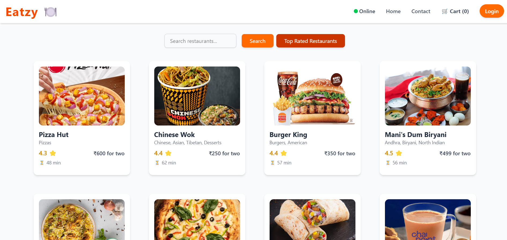

# Eatzy

Eatzy is a React-based project built from scratch with a focus on modular component design. **Note:** This project is a work in progress—please be aware that some features and documentation may be updated as development continues. Contributions, suggestions, and feedback are always welcome!

## 📸 Screenshot
  
*Current UI of Eatzy showcasing a modern food delivery app experience. More features and enhancements coming soon!*

## 📋 Table of Contents
- [📖 About](#about)  
- [✨ Features](#features)  
- [🛠 Tech Stack](#tech-stack)  
- [⚙️ Installation](#installation)  
- [🚀 Usage](#usage)  
- [🧪 Testing](#testing)  
- [📊 Project Status](#project-status)  
- [🤝 Contributing](#contributing)  
- [📝 License](#license)  

## 📖 About

Eatzy is designed to showcase modern web development practices using React. The project leverages Tailwind CSS for rapid and consistent UI styling, Redux and Redux Toolkit for effective state management, and Jest for testing. It explores both functional and class-based components, essential React Hooks, and React Routing for dynamic navigation.

## ✨ Features

- **Modular Component Design:** Dive into JSX and core React features using both functional and class-based components.  
- **Tailwind CSS Integration:** Rapid UI development and consistent styling using a utility-first approach.  
- **State Management:** Effective state management using Redux and Redux Toolkit.  
- **Dynamic Navigation:** Implementation of React Router for seamless navigation between views.  
- **Testing:** Comprehensive testing with the Jest framework to ensure reliability.

## 🛠 Tech Stack

- **Frontend:** React  
- **Styling:** Tailwind CSS  
- **State Management:** Redux, Redux Toolkit  
- **Testing:** Jest  
- **Build Tooling:** Parcel

## ⚙️ Installation

1. **Clone the Repository:**  
   ```bash
   git clone https://github.com/ashmita41/eatzy.git
   cd eatzy
   ```  
2. **Install Dependencies:**  
   ```bash
   npm install  
   # or if you prefer Yarn:  
   yarn install
   ```  
3. **Configure Tailwind CSS:**  
   Ensure you have set up your `tailwind.config.js` file and imported your Tailwind CSS file in your project as per the [Tailwind CSS documentation](https://tailwindcss.com/docs/installation).

## 🚀 Usage

Start the development server with:  
```bash
npm start  
# or if using Yarn:  
yarn start
```  
The application should now be running at [http://localhost:1234](http://localhost:1234).

## 🧪 Testing

To run the test suite with Jest, use:  
```bash
npm test  
# or if using Yarn:  
yarn test
```  

## 📊 Project Status

**Note:** This project is currently under active development. New features, UI enhancements, and performance optimizations are planned. Check back regularly for updates!

## 🤝 Contributing

Contributions are very welcome! If you’d like to contribute, please follow these steps:  
1. **Fork the Repository:** Click the "Fork" button at the top-right of the repository page.  
2. **Create a Feature Branch:**  
   ```bash
   git checkout -b feature/your-feature-name  
   ```  
3. **Commit Your Changes:**  
   ```bash
   git commit -m "Add some feature"  
   ```  
4. **Push to the Branch:**  
   ```bash
   git push origin feature/your-feature-name  
   ```  
5. **Open a Pull Request:** Go to the repository page and click "New Pull Request."

## 📝 License

This project is open source and available under the [MIT License](LICENSE).
